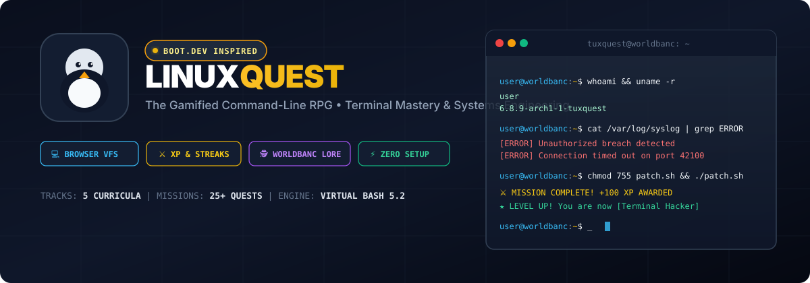

<div align="center">



# 🐧 LinuxQuest: The Gamified Linux Terminal RPG
### *Master the Shell, Defend WorldBanc Systems, and Escape Tutorial Hell*

[](https://hammadshakeelai.github.io/linux-quest/)
[](https://github.com/hammadshakeelai/linux-quest/actions)
[](https://react.dev/)
[](https://www.typescriptlang.org/)
[](https://tailwindcss.com/)
[](https://opensource.org/licenses/MIT)

<br/>

[🎮 **Play Live on GitHub Pages**](https://hammadshakeelai.github.io/linux-quest/) • [📖 **Course Tracks**](#-curriculum-overview) • [💻 **Virtual Terminal Engine**](#-in-browser-virtual-linux-terminal-vfs) • [🏆 **Gamification**](#-gamification--rpg-mechanics) • [⚡ **Quickstart**](#-quickstart)

<br/>

---

</div>

## 📖 About LinuxQuest

**LinuxQuest** is an interactive, gamified command-line learning platform built in the signature style of **[Boot.dev](https://boot.dev)**. 

Most aspiring developers and DevOps engineers get trapped in **"Tutorial Hell"** — passively binge-watching 8-hour video courses without ever touching a command prompt. The second they are confronted with a real remote Linux server, they freeze.

LinuxQuest solves this through **pure active recall, continuous hands-on command execution, and immersive storytelling**. 

### 🕵️ The Story: The WorldBanc Incident
You are an elite forensic sysadmin hired by **WorldBanc InfoSec**. An unauthorized breach has occurred on a secure banking node (`tuxquest-node-1`). 
- Instead of memorizing isolated commands in a vacuum, you inspect live crime scenes.
- You traverse compromised directory trees, decipher hidden dossiers, parse corrupted access logs with `grep` and Unix pipelines, revoke rogue file permissions using octal `chmod`, and terminate unauthorized background daemons with `kill`.

---

## ✨ Features at a Glance

| Feature | Description |
| :--- | :--- |
| 💻 **Simulated Linux Terminal** | High-performance in-browser shell supporting pipes (`\|`), output redirection (`>`, `>>`), tab autocompletion, and bash history. |
| 🗄️ **Virtual Filesystem (VFS)** | In-memory hierarchical directory tree (`/home/user`, `/etc`, `/var/log`, `/bin`) with real file nodes, permissions, and timestamps. |
| 🧪 **Instant Test Evaluation** | Automated verification engine tests terminal inputs, file existence, contents, and permission bits in real-time. |
| 🎮 **RPG Progression Engine** | Earn **XP**, maintain daily **Streaks**, level up across 6 rank tiers (*Script Novice* ➔ *Kernel Overlord*), and collect rare badges. |
| 💡 **Socratic Hint System** | Progressive clue drawer gives you gentle nudges so you solve missions through your own critical thinking. |
| 🏕️ **Open Sandbox Mode** | Switch out of guided missions anytime into an unconstrained Linux sandbox with a visual file tree explorer. |
| 🌐 **Zero Setup Required** | Runs 100% in modern browsers via WebAssembly/VFS principles. No Docker or cloud VMs required to start learning. |

---

## 🗺️ Curriculum Overview

```
Chapter 1: The Breach Investigation (Navigation & Inspection)
├── 01. The Crime Scene (pwd & ls)
├── 02. Reading the Welcome Wiretap (cat)
└── 03. Traversal & Hidden Evidence (cd & ls -la)

Chapter 2: File Creation & Manipulation
├── 04. Setting Up the War Room (mkdir & touch)
└── 05. Writing Case Notes (echo & redirection >)

Chapter 3: The Power of Pipes & Filtering
├── 06. Hunting the Breach with Grep (grep)
└── 07. Piping and Counting (cat | grep | wc -l)

Chapter 4: Permissions & Security Hardening
└── 08. Locking Down the Vault (chmod 755 & 600)

Chapter 5: Process Control & Systemd
└── 09. Neutralizing Rogue Daemons (ps & kill)
```

---

## 🎮 Gamification & RPG Mechanics

### 🎖️ Leveling Tiers
As you solve objectives and complete forensic missions, your character advances through system security clearances:

| Level | Rank Title | XP Requirement | Perks / Status |
| :---: | :--- | :---: | :--- |
| **1** | **Script Novice** | 0 XP | Granted shell access to `/home/user` |
| **2** | **Bash Apprentice** | 100 XP | Unlocked redirection and file creation privileges |
| **3** | **Terminal Hacker** | 250 XP | Mastered multi-stage Unix pipelines |
| **4** | **Sysadmin Paladin** | 450 XP | Granted permission to audit `/var/log` |
| **5** | **DevOps Vanguard** | 700 XP | Armed with process inspection and signal tooling |
| **6** | **Kernel Overlord** | 1000 XP | Root sovereign of the WorldBanc cluster |

### 🏆 Unlockable Badges
- ⚔️ **First Terminal Blood**: Execute your first command.
- 🧭 **Pathfinder**: Traverse directories using relative and absolute paths.
- 🪵 **Digital Carpenter**: Create directories and files with `mkdir` & `touch`.
- 🧬 **Pipe Dreamer**: Chain stdout directly to stdin with `|`.
- 🔍 **Pattern Hunter**: Filter system logs with `grep`.
- 🛡️ **Permissions Sentinel**: Configure secure permissions with `chmod`.
- ☠️ **Daemon Slayer**: Kill rogue background processes.
- 👑 **Kernel Overlord**: Complete the entire campaign.

---

## 💻 In-Browser Virtual Linux Terminal (VFS)

The shell engine emulates standard GNU/Linux coreutils:
- **Navigation**: `pwd`, `cd`, `ls` (supports flags `-l`, `-a`, `-la`, `-lh`)
- **Inspection**: `cat`, `head`, `tail`, `wc` (supports `-l`, `-w`, `-c`)
- **Manipulation**: `touch`, `mkdir` (supports `-p`), `rm` (supports `-rf`), `echo`
- **Pattern Matching**: `grep` (supports `-i`, `-v`, `-n`)
- **Permissions**: `chmod` (supports octal `755`, `644`, `600` and symbolic `+x`)
- **Processes**: `ps`, `kill`
- **Shell Features**:
  - Piping: `cat /var/log/syslog | grep ERROR | wc -l`
  - Redirection: `echo "data" > file.txt` and `echo "more" >> file.txt`
  - Tab Autocompletion: Suggests both shell builtins and filesystem paths
  - History Navigation: `↑` and `↓` arrow keys

---

## ⚡ Quickstart

### Prerequisites
- Node.js (v18+)
- npm (v9+)

### Local Development

```bash
# 1. Clone the repository
git clone https://github.com/hammadshakeelai/linux-quest.git

# 2. Enter project directory
cd linux-quest

# 3. Install dependencies
npm install

# 4. Start local development server
npm run dev
```

Open `http://localhost:5173` in your browser.

### Building for Production

```bash
npm run build
```

The output bundle will be generated in `dist/`.

---

## 🚀 GitHub Pages Deployment

The repository is pre-configured with a zero-configuration **GitHub Actions** deployment pipeline ([`.github/workflows/deploy.yml`](.github/workflows/deploy.yml)).

Whenever changes are pushed to `master`, GitHub Actions automatically builds the project and deploys it directly to GitHub Pages at:

👉 **[https://hammadshakeelai.github.io/linux-quest/](https://hammadshakeelai.github.io/linux-quest/)**

---

## 🏷️ Tags & Topics

`linux` • `bash` • `bootdev` • `terminal` • `devops` • `sysadmin` • `gamified-learning` • `react` • `typescript` • `educational` • `interactive-learning` • `virtual-filesystem`

---

## 📜 License

Distributed under the **MIT License**. See `LICENSE` for more information.

Developed with ❤️ for developers escaping tutorial hell by **[Hammad Shakeel](https://github.com/hammadshakeelai)**.
